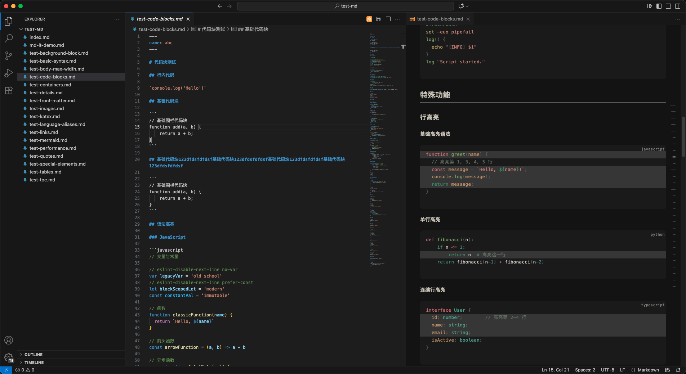
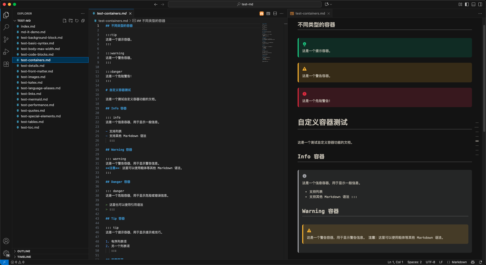
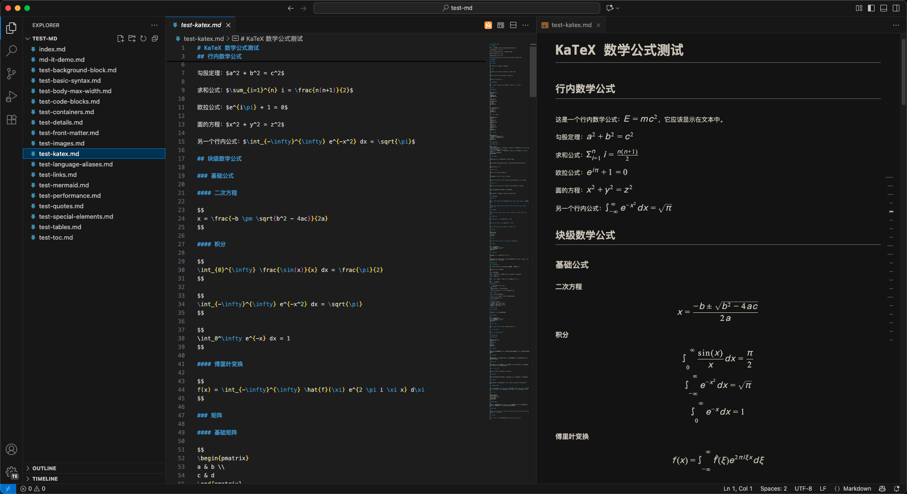
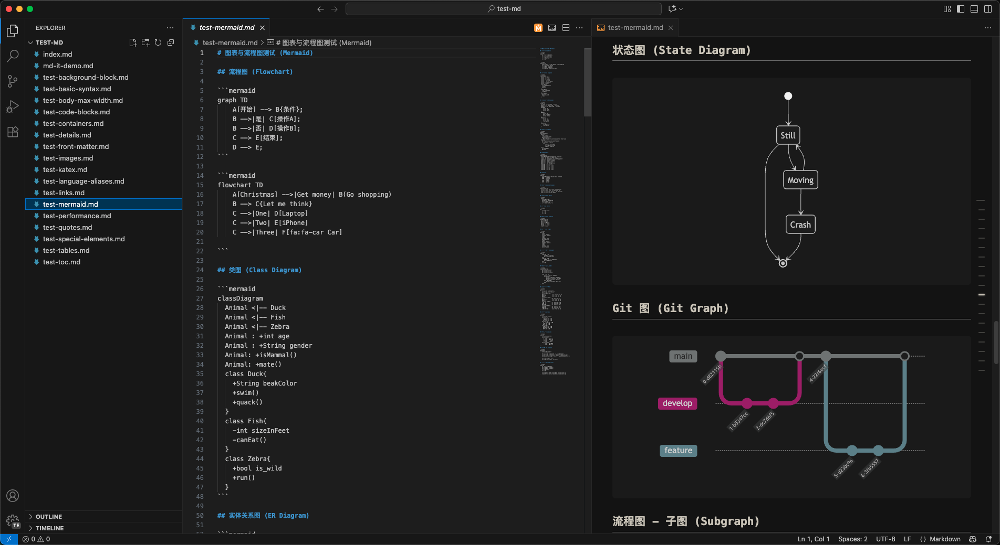
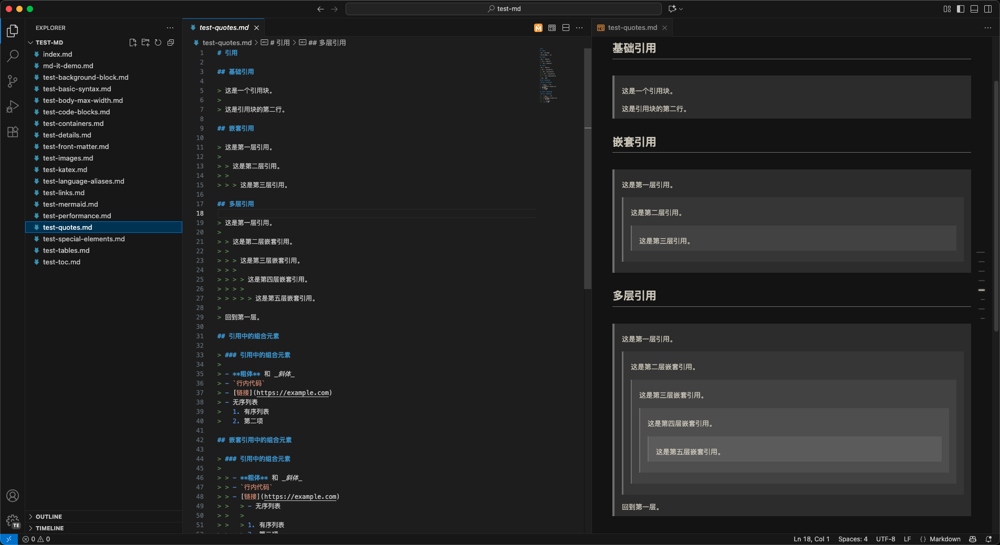

# Shiki Markdown Preview

[](https://marketplace.visualstudio.com/items?itemName=fxzer8888.shiki-markdown-preview)
[](https://marketplace.visualstudio.com/items?itemName=fxzer8888.shiki-markdown-preview)
[](https://marketplace.visualstudio.com/items?itemName=fxzer8888.shiki-markdown-preview)

[中文文档](README-ZH.md) | [English Documentation](README.md)

A powerful VS Code extension that provides Shiki-based Markdown preview functionality with support for 60+ syntax highlighting themes.

## 📦 Installation

### From VS Code Marketplace

1. Open VS Code
2. Go to Extensions (Ctrl+Shift+X / Cmd+Shift+X)
3. Search for "Shiki Markdown Preview"
4. Click Install

**Or install directly from the marketplace:**
[](https://marketplace.visualstudio.com/items?itemName=fxzer8888.shiki-markdown-preview)

## ✨ Features

- 🎨 **Rich Theme Selection**: Support for [60+ Shiki themes](https://shiki.style/themes), including light and dark themes
- ⌨️ **Interactive Theme Picker**: Use keyboard arrow keys to preview different themes in real-time
- 📝 **Code Syntax Highlighting**: Integrated Shiki syntax highlighting for [all programming languages](https://shiki.style/languages), with code copy support
- 🔗 **Bidirectional Scroll Sync**: Real-time scroll synchronization between editor and preview area
- 📱 **Responsive Design**: Adaptive layout for different screen sizes
- 🎯 **Auto-generated TOC**: Auto-generated Notion-style table of contents
- 🖼️ **Image Lazy Loading**: Optimized image loading for better performance
- 📊 **Mermaid Support**: Built-in support for Mermaid diagrams
- 🧮 **Math Support**: LaTeX math rendering with KaTeX

## 📸 Screenshots

<div align="center">











</div>

## 🚀 Quick Start

### Version Support

`vscode >= 1.100.0`

### Installation

1. Open VS Code
2. Go to Extensions (Ctrl+Shift+X / Cmd+Shift+X)
3. Search for "Shiki Markdown Preview"
4. Click Install

### Usage

#### Method 1: Command Palette

1. Open a Markdown file
2. Press `Ctrl+Shift+P` (or `Cmd+Shift+P` on Mac)
3. Type "Shiki Markdown Preview"
4. Select "Open Markdown Preview Slide" or "Open Markdown Preview Full"

#### Method 2: Keyboard Shortcuts

- **Side Preview**: `Ctrl+Shift+V` (Windows/Linux) or `Cmd+Shift+V` (Mac)
- **Full Preview**: `Ctrl+K V` (Windows/Linux) or `Cmd+K V` (Mac)
- **Theme Selection**: `Ctrl+Shift+T` (Windows/Linux) or `Cmd+Shift+T` (Mac)

## 🎨 Theme Selection

The extension supports 60+ beautiful themes. You can switch themes in several ways:

### Interactive Theme Picker

1. Open the theme picker with `Ctrl+Shift+T` (or `Cmd+Shift+T` on Mac)
2. Use arrow keys to navigate through themes
3. Press Enter to select a theme

## ⚙️ Configuration

### Settings

You can customize the extension behavior through VS Code settings:

```json
{
  "shikiMarkdownPreview.currentTheme": "vitesse-dark",
  "shikiMarkdownPreview.documentWidth": "800px",
  "shikiMarkdownPreview.fontFamily": "inherit",
  "shikiMarkdownPreview.enableScrollSync": true
}
```

#### Configuration Options

| Setting                                 | Type    | Default          | Description                         |
| --------------------------------------- | ------- | ---------------- | ----------------------------------- |
| `shikiMarkdownPreview.currentTheme`     | string  | `"vitesse-dark"` | Current theme for markdown preview  |
| `shikiMarkdownPreview.documentWidth`    | string  | `"800px"`        | Document width (supports CSS units) |
| `shikiMarkdownPreview.fontFamily`       | string  | `"inherit"`      | Font family for preview             |
| `shikiMarkdownPreview.enableScrollSync` | boolean | `true`           | Enable scroll synchronization       |

### Supported CSS Units for Document Width

- `px` - Pixels
- `%` - Percentage
- `rem` - Root em units
- `em` - Em units
- `vw` - Viewport width
- `ch` - Character units
- `ex` - X-height units
- `cm`, `mm`, `in`, `pt`, `pc` - Physical units

## 🔧 Advanced Features

### Scroll Synchronization

- Real-time synchronization between editor and preview
- Smooth scrolling experience
- Maintains scroll position when switching themes

### Table of Contents

- Auto-generated TOC with anchor links
- Collapsible sections
- Smooth scrolling to sections

### Image Handling

- Lazy loading for better performance
- Support for relative and absolute paths
- Error handling for missing images

### Code Block Features

- Syntax highlighting for 60+ languages
- Line numbers support
- Copy code functionality
- Language detection

### Math Support

- LaTeX math rendering with KaTeX
- Inline and block math support
- Math syntax highlighting

### Diagram Support

- Mermaid diagram rendering
- Flowcharts, sequence diagrams, and more
- Syntax highlighting for diagram code

## 🛠️ Development

### Prerequisites

- Node.js 18+
- VS Code 1.100.0+
- TypeScript 5.9.2+

### Building

```bash
npm install
npm run compile
```

### Scripts

- `npm run compile` - Compile TypeScript
- `npm run watch` - Watch mode for development
- `npm run lint` - Run ESLint
- `npm run lint:fix` - Fix ESLint issues
- `npm run ext:package` - Package extension

### Project Structure

```
src/
├── index.ts                 # Main extension entry point
├── services/                # Core services
│   ├── config/             # Configuration management
│   ├── renderer/           # Markdown rendering
│   ├── scroll-sync/        # Scroll synchronization
│   ├── state/             # State management
│   └── theme/              # Theme management
├── types/                  # TypeScript type definitions
├── utils/                  # Utility functions
└── webview/                # Webview components
```

## 🤝 Contributing

### How to Contribute

1. Fork the repository
2. Create a feature branch
3. Make your changes
4. Add tests if applicable
5. Submit a pull request

## 📝 License

This project is licensed under the MIT License - see the [LICENSE](LICENSE) file for details.

## 🙏 Acknowledgments

- [Shiki](https://github.com/shikijs/shiki) - Beautiful syntax highlighter
- [VS Code](https://code.visualstudio.com/) - The amazing editor
- [Markdown-it](https://github.com/markdown-it/markdown-it) - Markdown parser
- All the theme authors and contributors

## 📞 Support

- 🐛 [Report Issues](https://github.com/fxzer/shiki-markdown-preview/issues)
- 💡 [Request Features](https://github.com/fxzer/shiki-markdown-preview/issues)
- 📖 [Documentation](https://github.com/fxzer/shiki-markdown-preview/wiki)

## 🛒 Get the Extension

[](https://marketplace.visualstudio.com/items?itemName=fxzer8888.shiki-markdown-preview)

**Available on VS Code Marketplace:** [Shiki Markdown Preview](https://marketplace.visualstudio.com/items?itemName=fxzer8888.shiki-markdown-preview)

---

**Made with ❤️ for the VS Code community**
