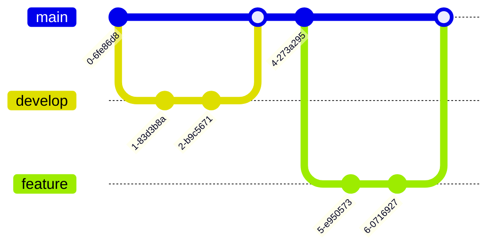

# 图表与流程图测试 (Mermaid)

## 流程图 (Flowchart)

## 类图 (Class Diagram)

## 实体关系图 (ER Diagram)

## 思维导图 (Mindmap)

## quadrantChart

## timeline

## 时序图 (Sequence Diagram)

## 甘特图 (Gantt Chart)

## 饼图 (Pie Chart)

## 状态图 (State Diagram)

## Git 图 (Git Graph)

## 流程图 - 子图 (Subgraph)

## 时序图 - 循环和条件

## 甘特图 - 复杂项目

## 旅程图 (Journey)

## 时间线图 (Timeline)

## C4 图表 (C4 Diagram)

## 流程图 - 不同方向和样式

