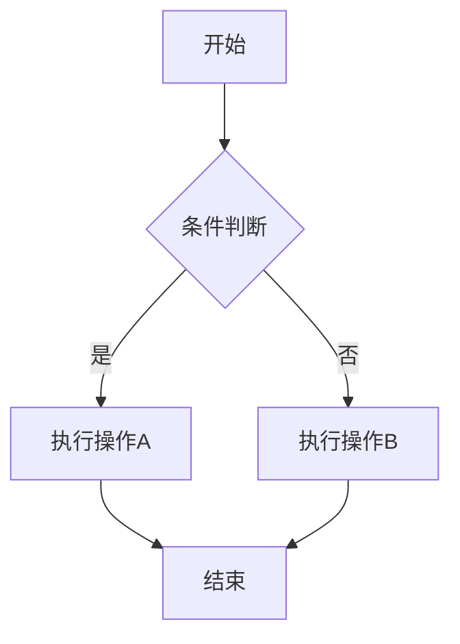
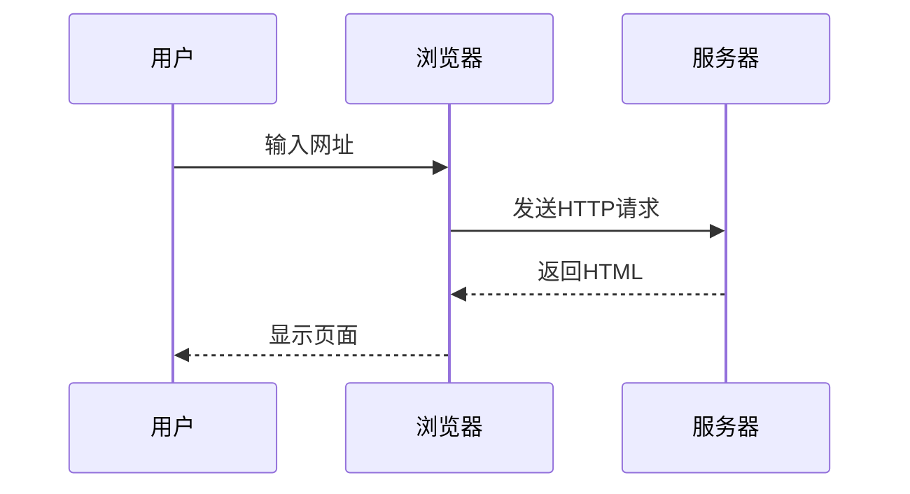
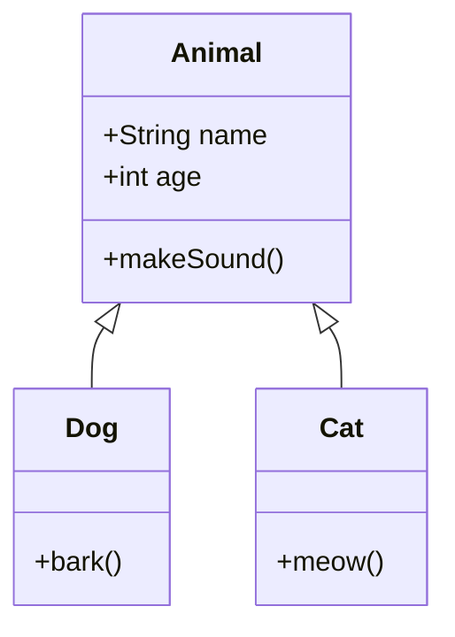
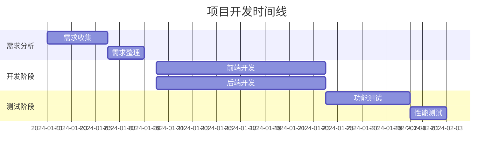
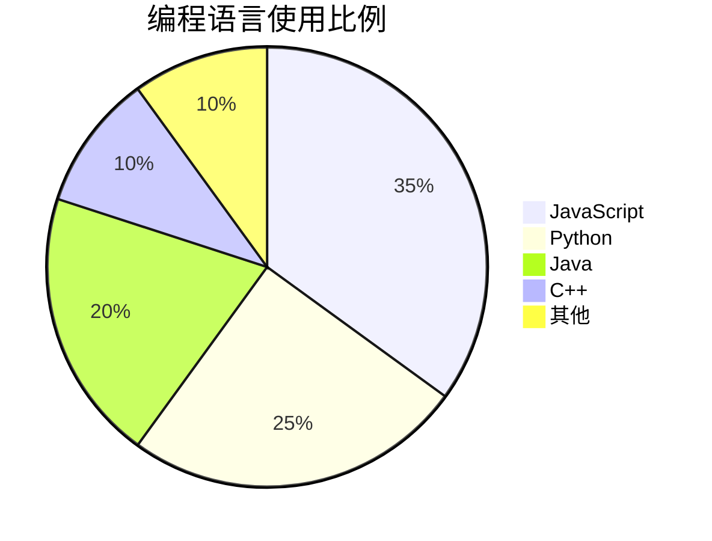
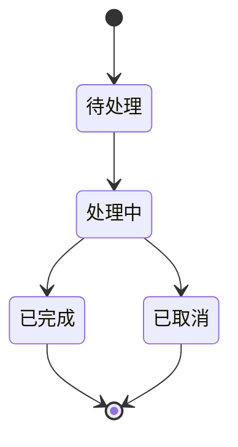

# Markdown 性能测试文档

## 概述

这是一个用于测试 Markdown 渲染性能的综合性文档。本文档包含了各种 Markdown 语法元素，以及大量重复内容，用于测试渲染引擎在各种情况下的性能表现。

## 目录

- [概述](#概述)
- [基础语法](#基础语法)
- [文本格式](#文本格式)
- [列表](#列表)
- [代码块](#代码块)
- [表格](#表格)
- [图片](#图片)
- [链接](#链接)
- [引用](#引用)
- [数学公式](#数学公式)
- [图表](#图表)
- [特殊元素](#特殊元素)
- [HTML 元素](#html-元素)
- [性能测试结果](#性能测试结果)

## 基础语法

### 标题层级

# 一级标题

## 二级标题

### 三级标题

#### 四级标题

##### 五级标题

###### 六级标题

### 段落和换行

这是一个段落。段落之间应该有一个空行分隔。

这是另一个段落。在段落内部，可以使用两个空格来强制换行。
像这样，这行文字会出现在新的一行上。

### 分割线

---

---

---

## 文本格式

### 强调文本

- **粗体文本**：使用两个星号或下划线包裹文本
- **另一种粗体文本**：使用两个下划线
- _斜体文本_：使用一个星号或下划线
- _另一种斜体文本_：使用一个下划线
- **_粗斜体文本_**：使用三个星号
- **_另一种粗斜体文本_**：使用三个下划线
- ~~删除线文本~~：使用两个波浪线

### 行内代码

在行内插入代码可以使用反引号：`console.log('Hello, World!')`

如果代码中包含反引号，可以使用多个反引号：`` `代码`包含反引号 ``

### 转义字符

使用反斜杠可以转义特殊字符：

\* 不是星号
\` 不是反引号
\[ 不是方括号
\( 不是圆括号
\# 不是井号
\+ 不是加号
\- 不是减号
\. 不是点
\! 不是感叹号

## 列表

### 无序列表

- 列表项 1
- 列表项 2
  - 嵌套列表项 2.1
  - 嵌套列表项 2.2
    - 更深层嵌套列表项 2.2.1
    - 更深层嵌套列表项 2.2.2
- 列表项 3
- 列表项 4

### 有序列表

1. 列表项 1
2. 列表项 2
   1. 嵌套列表项 2.1
   2. 嵌套列表项 2.2
      1. 更深层嵌套列表项 2.2.1
      2. 更深层嵌套列表项 2.2.2
3. 列表项 3
4. 列表项 4

### 任务列表

- [x] 已完成的任务 1
- [ ] 未完成的任务 1
- [x] 已完成的任务 2
  - [x] 已完成的子任务 2.1
  - [ ] 未完成的子任务 2.2
- [ ] 未完成的任务 2
  - [ ] 未完成的子任务 3.1
  - [x] 已完成的子任务 3.2

### 定义列表

术语 1
: 这是术语 1 的定义

术语 2
: 这是术语 2 的定义
: 这是术语 2 的另一个定义

术语 3
: 这是术语 3 的定义，可以包含*斜体*、**粗体**和`代码`等格式。

## 代码块

### 基础代码块

```
这是一个没有语言标识的代码块
function hello() {
    console.log("Hello, World!");
}
```

### JavaScript 代码块

```javascript
// JavaScript 示例代码
// 使用模块
import { useEffect, useState } from 'react'

function fibonacci(n) {
  if (n <= 1) {
    return n
  }
  return fibonacci(n - 1) + fibonacci(n - 2)
}

// 使用箭头函数
function factorial(n) {
  if (n === 0 || n === 1) {
    return 1
  }
  return n * factorial(n - 1)
}

// 异步函数
async function fetchData(url) {
  try {
    const response = await fetch(url)
    const data = await response.json()
    return data
  }
  catch (error) {
    console.error('Error fetching data:', error)
    throw error
  }
}

// 类定义
class Person {
  constructor(name, age) {
    this.name = name
    this.age = age
  }

  greet() {
    return `Hello, my name is ${this.name} and I am ${this.age} years old.`
  }
}

function Counter() {
  const [count, setCount] = useState(0)

  useEffect(() => {
    document.title = `Count: ${count}`
  }, [count])

  return (
    <div>
      <p>
        You clicked
        {count}
        {' '}
        times
      </p>
      <button onClick={() => setCount(count + 1)}>
        Click me
      </button>
    </div>
  )
}
```

### Python 代码块

```python
# Python 示例代码
import asyncio
import json
from typing import List, Dict, Optional, Union
from dataclasses import dataclass, asdict
from datetime import datetime, timedelta
from pathlib import Path

@dataclass
class User:
    id: int
    name: str
    email: str
    created_at: datetime
    is_active: bool = True

class UserManager:
    def __init__(self):
        self.users: Dict[int, User] = {}

    def add_user(self, user: User) -> None:
        """添加用户到管理器"""
        self.users[user.id] = user
        print(f"Added user: {user.name}")

    def get_user(self, user_id: int) -> Optional[User]:
        """根据ID获取用户"""
        return self.users.get(user_id)

    def get_active_users(self) -> List[User]:
        """获取所有活跃用户"""
        return [user for user in self.users.values() if user.is_active]

    def update_user(self, user_id: int, **kwargs) -> bool:
        """更新用户信息"""
        user = self.users.get(user_id)
        if not user:
            return False

        for key, value in kwargs.items():
            if hasattr(user, key):
                setattr(user, key, value)

        return True

    def delete_user(self, user_id: int) -> bool:
        """删除用户"""
        if user_id in self.users:
            del self.users[user_id]
            return True
        return False

    def save_to_file(self, file_path: Union[str, Path]) -> None:
        """保存用户数据到文件"""
        file_path = Path(file_path)
        users_data = [
            {
                **asdict(user),
                "created_at": user.created_at.isoformat()
            }
            for user in self.users.values()
        ]

        with open(file_path, 'w', encoding='utf-8') as f:
            json.dump(users_data, f, indent=2, ensure_ascii=False)

    def load_from_file(self, file_path: Union[str, Path]) -> None:
        """从文件加载用户数据"""
        file_path = Path(file_path)
        if not file_path.exists():
            return

        with open(file_path, 'r', encoding='utf-8') as f:
            users_data = json.load(f)

        self.users = {}
        for user_data in users_data:
            user_data["created_at"] = datetime.fromisoformat(user_data["created_at"])
            user = User(**user_data)
            self.users[user.id] = user

# 异步函数示例
async def fetch_data(url: str) -> Dict:
    """异步获取数据"""
    import aiohttp

    async with aiohttp.ClientSession() as session:
        async with session.get(url) as response:
            if response.status == 200:
                return await response.json()
            else:
                raise Exception(f"HTTP {response.status}")

# 生成器函数
def fibonacci_generator(n: int):
    """生成斐波那契数列"""
    a, b = 0, 1
    for _ in range(n):
        yield a
        a, b = b, a + b

# 使用上下文管理器
class FileHandler:
    def __init__(self, file_path: str, mode: str = 'r'):
        self.file_path = file_path
        self.mode = mode
        self.file = None

    def __enter__(self):
        self.file = open(self.file_path, self.mode, encoding='utf-8')
        return self.file

    def __exit__(self, exc_type, exc_val, exc_tb):
        if self.file:
            self.file.close()

# 使用示例
if __name__ == "__main__":
    manager = UserManager()

    # 创建用户
    user1 = User(1, "张三", "zhangsan@example.com", datetime.now())
    user2 = User(2, "李四", "lisi@example.com", datetime.now())

    # 添加用户
    manager.add_user(user1)
    manager.add_user(user2)

    # 获取用户
    user = manager.get_user(1)
    if user:
        print(f"Found user: {user.name}")

    # 获取活跃用户
    active_users = manager.get_active_users()
    print(f"Active users: {[u.name for u in active_users]}")

    # 更新用户
    manager.update_user(1, name="张三（更新）")

    # 保存到文件
    manager.save_to_file("users.json")

    # 从文件加载
    new_manager = UserManager()
    new_manager.load_from_file("users.json")

    # 使用生成器
    for num in fibonacci_generator(10):
        print(num)

    # 使用上下文管理器
    with FileHandler("example.txt", "w") as f:
        f.write("Hello, World!")
```

### CSS 代码块

```css
/* CSS 示例代码 */
:root {
  --primary-color: #3b82f6;
  --secondary-color: #64748b;
  --background-color: #f8fafc;
  --text-color: #1e293b;
  --border-color: #e2e8f0;
  --border-radius: 0.5rem;
  --box-shadow: 0 1px 3px 0 rgba(0, 0, 0, 0.1), 0 1px 2px 0 rgba(0, 0, 0, 0.06);
  --transition: all 0.3s ease;
}

* {
  box-sizing: border-box;
  margin: 0;
  padding: 0;
}

body {
  font-family: -apple-system, BlinkMacSystemFont, 'Segoe UI', Roboto, Oxygen, Ubuntu, Cantarell, sans-serif;
  line-height: 1.6;
  color: var(--text-color);
  background-color: var(--background-color);
}

.container {
  max-width: 1200px;
  margin: 0 auto;
  padding: 0 1rem;
}

.header {
  background-color: white;
  box-shadow: var(--box-shadow);
  position: sticky;
  top: 0;
  z-index: 100;
}

.nav {
  display: flex;
  justify-content: space-between;
  align-items: center;
  padding: 1rem 0;
}

.logo {
  font-size: 1.5rem;
  font-weight: bold;
  color: var(--primary-color);
  text-decoration: none;
  transition: var(--transition);
}

.logo:hover {
  opacity: 0.8;
}

.nav-links {
  display: flex;
  list-style: none;
  gap: 1.5rem;
}

.nav-link {
  color: var(--text-color);
  text-decoration: none;
  font-weight: 500;
  transition: var(--transition);
  position: relative;
}

.nav-link::after {
  content: '';
  position: absolute;
  bottom: -0.25rem;
  left: 0;
  width: 0;
  height: 2px;
  background-color: var(--primary-color);
  transition: width 0.3s ease;
}

.nav-link:hover::after {
  width: 100%;
}

.hero {
  padding: 4rem 0;
  text-align: center;
}

.hero-title {
  font-size: 3rem;
  font-weight: bold;
  margin-bottom: 1rem;
  background: linear-gradient(135deg, var(--primary-color), #8b5cf6);
  -webkit-background-clip: text;
  -webkit-text-fill-color: transparent;
  background-clip: text;
}

.hero-subtitle {
  font-size: 1.25rem;
  color: var(--secondary-color);
  margin-bottom: 2rem;
}

.btn {
  display: inline-block;
  padding: 0.75rem 1.5rem;
  background-color: var(--primary-color);
  color: white;
  border: none;
  border-radius: var(--border-radius);
  font-size: 1rem;
  font-weight: 500;
  text-decoration: none;
  cursor: pointer;
  transition: var(--transition);
}

.btn:hover {
  background-color: #2563eb;
  transform: translateY(-2px);
  box-shadow:
    0 4px 6px -1px rgba(0, 0, 0, 0.1),
    0 2px 4px -1px rgba(0, 0, 0, 0.06);
}

.btn-secondary {
  background-color: white;
  color: var(--primary-color);
  border: 1px solid var(--primary-color);
}

.btn-secondary:hover {
  background-color: var(--primary-color);
  color: white;
}

.features {
  padding: 4rem 0;
  background-color: white;
}

.section-title {
  font-size: 2rem;
  font-weight: bold;
  text-align: center;
  margin-bottom: 3rem;
}

.features-grid {
  display: grid;
  grid-template-columns: repeat(auto-fit, minmax(300px, 1fr));
  gap: 2rem;
}

.feature-card {
  padding: 2rem;
  background-color: var(--background-color);
  border-radius: var(--border-radius);
  box-shadow: var(--box-shadow);
  transition: var(--transition);
}

.feature-card:hover {
  transform: translateY(-5px);
  box-shadow:
    0 10px 15px -3px rgba(0, 0, 0, 0.1),
    0 4px 6px -2px rgba(0, 0, 0, 0.05);
}

.feature-icon {
  font-size: 2.5rem;
  margin-bottom: 1rem;
}

.feature-title {
  font-size: 1.25rem;
  font-weight: bold;
  margin-bottom: 0.5rem;
}

.feature-description {
  color: var(--secondary-color);
  line-height: 1.8;
}

.pricing {
  padding: 4rem 0;
}

.pricing-cards {
  display: grid;
  grid-template-columns: repeat(auto-fit, minmax(300px, 1fr));
  gap: 2rem;
}

.pricing-card {
  padding: 2rem;
  background-color: white;
  border-radius: var(--border-radius);
  box-shadow: var(--box-shadow);
  text-align: center;
  transition: var(--transition);
  position: relative;
}

.pricing-card.featured {
  border: 2px solid var(--primary-color);
  transform: scale(1.05);
}

.pricing-badge {
  position: absolute;
  top: -1rem;
  right: 1rem;
  background-color: var(--primary-color);
  color: white;
  padding: 0.25rem 0.75rem;
  border-radius: 9999px;
  font-size: 0.875rem;
  font-weight: 500;
}

.pricing-title {
  font-size: 1.5rem;
  font-weight: bold;
  margin-bottom: 1rem;
}

.pricing-price {
  font-size: 3rem;
  font-weight: bold;
  margin-bottom: 0.5rem;
}

.pricing-period {
  color: var(--secondary-color);
  font-size: 1rem;
  margin-bottom: 2rem;
}

.pricing-features {
  list-style: none;
  margin-bottom: 2rem;
  text-align: left;
}

.pricing-feature {
  padding: 0.5rem 0;
  border-bottom: 1px solid var(--border-color);
}

.pricing-feature:last-child {
  border-bottom: none;
}

.footer {
  background-color: #1e293b;
  color: white;
  padding: 3rem 0 1rem;
}

.footer-content {
  display: grid;
  grid-template-columns: repeat(auto-fit, minmax(250px, 1fr));
  gap: 2rem;
  margin-bottom: 2rem;
}

.footer-column h3 {
  font-size: 1.25rem;
  margin-bottom: 1rem;
}

.footer-links {
  list-style: none;
}

.footer-link {
  color: #94a3b8;
  text-decoration: none;
  padding: 0.25rem 0;
  display: block;
  transition: var(--transition);
}

.footer-link:hover {
  color: white;
}

.footer-bottom {
  text-align: center;
  padding-top: 2rem;
  border-top: 1px solid #334155;
  color: #94a3b8;
}

/* 响应式设计 */
@media (max-width: 768px) {
  .hero-title {
    font-size: 2rem;
  }

  .nav-links {
    display: none;
  }

  .pricing-card.featured {
    transform: none;
  }

  .features-grid,
  .pricing-cards {
    grid-template-columns: 1fr;
  }
}

/* 暗色模式 */
@media (prefers-color-scheme: dark) {
  :root {
    --background-color: #0f172a;
    --text-color: #f1f5f9;
    --secondary-color: #94a3b8;
    --border-color: #1e293b;
  }

  body {
    background-color: var(--background-color);
    color: var(--text-color);
  }

  .header,
  .features,
  .pricing-card {
    background-color: #1e293b;
  }

  .feature-card {
    background-color: #0f172a;
  }
}

/* 动画 */
@keyframes fadeIn {
  from {
    opacity: 0;
    transform: translateY(20px);
  }
  to {
    opacity: 1;
    transform: translateY(0);
  }
}

.fade-in {
  animation: fadeIn 0.6s ease-out;
}
```

### HTML 代码块

```html
<!doctype html>
<html lang="zh-CN">
  <head>
    <meta charset="UTF-8" />
    <meta name="viewport" content="width=device-width, initial-scale=1.0" />
    <title>响应式网页示例</title>
    <link rel="stylesheet" href="styles.css" />
  </head>
  <body>
    <header class="header">
      <div class="container">
        <nav class="nav">
          <a href="#" class="logo">网站名称</a>
          <ul class="nav-links">
            <li><a href="#" class="nav-link">首页</a></li>
            <li><a href="#" class="nav-link">关于</a></li>
            <li><a href="#" class="nav-link">服务</a></li>
            <li><a href="#" class="nav-link">联系我们</a></li>
          </ul>
          <button class="mobile-menu-btn">
            <span class="bar"></span>
            <span class="bar"></span>
            <span class="bar"></span>
          </button>
        </nav>
      </div>
    </header>

    <main>
      <section class="hero">
        <div class="container">
          <h1 class="hero-title">欢迎来到我们的网站</h1>
          <p class="hero-subtitle">提供优质的服务和解决方案，满足您的各种需求</p>
          <div class="hero-buttons">
            <a href="#" class="btn">开始使用</a>
            <a href="#" class="btn btn-secondary">了解更多</a>
          </div>
        </div>
      </section>

      <section class="features">
        <div class="container">
          <h2 class="section-title">我们的特点</h2>
          <div class="features-grid">
            <article class="feature-card">
              <div class="feature-icon">🚀</div>
              <h3 class="feature-title">高性能</h3>
              <p class="feature-description">采用最新技术栈，确保网站加载速度快，用户体验流畅。</p>
            </article>
            <article class="feature-card">
              <div class="feature-icon">🎨</div>
              <h3 class="feature-title">精美设计</h3>
              <p class="feature-description">专业的UI/UX设计，打造美观且易用的界面。</p>
            </article>
            <article class="feature-card">
              <div class="feature-icon">🛡️</div>
              <h3 class="feature-title">安全可靠</h3>
              <p class="feature-description">采用最新的安全措施，保护您的数据和隐私。</p>
            </article>
            <article class="feature-card">
              <div class="feature-icon">📱</div>
              <h3 class="feature-title">响应式设计</h3>
              <p class="feature-description">完美适配各种设备，无论是手机、平板还是桌面电脑。</p>
            </article>
            <article class="feature-card">
              <div class="feature-icon">⚡</div>
              <h3 class="feature-title">快速部署</h3>
              <p class="feature-description">简单的部署流程，让您快速上线并开始使用。</p>
            </article>
            <article class="feature-card">
              <div class="feature-icon">🌐</div>
              <h3 class="feature-title">全球化支持</h3>
              <p class="feature-description">支持多语言和多种货币，服务全球用户。</p>
            </article>
          </div>
        </div>
      </section>

      <section class="pricing">
        <div class="container">
          <h2 class="section-title">价格方案</h2>
          <div class="pricing-cards">
            <div class="pricing-card">
              <h3 class="pricing-title">基础版</h3>
              <div class="pricing-price">¥0<span class="pricing-period">/月</span></div>
              <ul class="pricing-features">
                <li class="pricing-feature">✓ 基础功能</li>
                <li class="pricing-feature">✓ 5个项目</li>
                <li class="pricing-feature">✓ 社区支持</li>
                <li class="pricing-feature">✗ 高级功能</li>
                <li class="pricing-feature">✗ 优先支持</li>
              </ul>
              <a href="#" class="btn">选择方案</a>
            </div>
            <div class="pricing-card featured">
              <span class="pricing-badge">推荐</span>
              <h3 class="pricing-title">专业版</h3>
              <div class="pricing-price">¥99<span class="pricing-period">/月</span></div>
              <ul class="pricing-features">
                <li class="pricing-feature">✓ 基础功能</li>
                <li class="pricing-feature">✓ 无限项目</li>
                <li class="pricing-feature">✓ 邮件支持</li>
                <li class="pricing-feature">✓ 高级功能</li>
                <li class="pricing-feature">✗ 优先支持</li>
              </ul>
              <a href="#" class="btn">选择方案</a>
            </div>
            <div class="pricing-card">
              <h3 class="pricing-title">企业版</h3>
              <div class="pricing-price">¥299<span class="pricing-period">/月</span></div>
              <ul class="pricing-features">
                <li class="pricing-feature">✓ 基础功能</li>
                <li class="pricing-feature">✓ 无限项目</li>
                <li class="pricing-feature">✓ 24/7支持</li>
                <li class="pricing-feature">✓ 高级功能</li>
                <li class="pricing-feature">✓ 优先支持</li>
              </ul>
              <a href="#" class="btn">选择方案</a>
            </div>
          </div>
        </div>
      </section>

      <section class="testimonials">
        <div class="container">
          <h2 class="section-title">客户评价</h2>
          <div class="testimonials-slider">
            <div class="testimonial-card">
              <div class="testimonial-content">
                <p>"这个产品彻底改变了我们的工作方式，效率提升了至少50%。"</p>
              </div>
              <div class="testimonial-author">
                
                <div class="author-info">
                  <h4 class="author-name">张三</h4>
                  <p class="author-title">科技公司CEO</p>
                </div>
              </div>
            </div>
            <div class="testimonial-card">
              <div class="testimonial-content">
                <p>"界面设计非常直观，功能强大，客户服务也很到位。"</p>
              </div>
              <div class="testimonial-author">
                
                <div class="author-info">
                  <h4 class="author-name">李四</h4>
                  <p class="author-title">产品经理</p>
                </div>
              </div>
            </div>
            <div class="testimonial-card">
              <div class="testimonial-content">
                <p>"从部署到使用都非常简单，团队很快就上手了。"</p>
              </div>
              <div class="testimonial-author">
                
                <div class="author-info">
                  <h4 class="author-name">王五</h4>
                  <p class="author-title">开发团队负责人</p>
                </div>
              </div>
            </div>
          </div>
        </div>
      </section>

      <section class="cta">
        <div class="container">
          <div class="cta-content">
            <h2 class="cta-title">准备好开始了吗？</h2>
            <p class="cta-description">立即注册，享受30天免费试用</p>
            <a href="#" class="btn btn-large">立即注册</a>
          </div>
        </div>
      </section>
    </main>

    <footer class="footer">
      <div class="container">
        <div class="footer-content">
          <div class="footer-column">
            <h3>关于我们</h3>
            <p>我们是一家专注于提供高质量解决方案的公司，致力于帮助客户实现业务目标。</p>
          </div>
          <div class="footer-column">
            <h3>快速链接</h3>
            <ul class="footer-links">
              <li><a href="#" class="footer-link">首页</a></li>
              <li><a href="#" class="footer-link">关于我们</a></li>
              <li><a href="#" class="footer-link">服务</a></li>
              <li><a href="#" class="footer-link">联系我们</a></li>
            </ul>
          </div>
          <div class="footer-column">
            <h3>服务</h3>
            <ul class="footer-links">
              <li><a href="#" class="footer-link">网站开发</a></li>
              <li><a href="#" class="footer-link">移动应用</a></li>
              <li><a href="#" class="footer-link">云服务</a></li>
              <li><a href="#" class="footer-link">咨询服务</a></li>
            </ul>
          </div>
          <div class="footer-column">
            <h3>联系我们</h3>
            <ul class="footer-links">
              <li><a href="#" class="footer-link">邮箱: info@example.com</a></li>
              <li><a href="#" class="footer-link">电话: +86 123 4567 8901</a></li>
              <li><a href="#" class="footer-link">地址: 北京市朝阳区某某街道</a></li>
            </ul>
          </div>
        </div>
        <div class="footer-bottom">
          <p>&copy; 2024 公司名称. 保留所有权利.</p>
        </div>
      </div>
    </footer>

    <script src="script.js"></script>
  </body>
</html>
```

### 行高亮代码块

```javascript{1,3-5}
function greet(name) {
  // 这行会被高亮
  const message = `Hello, ${name}!`;
  // 这两行也会被高亮
  console.log(message);
  return message;
}
```

### Diff 代码块

```diff
+ 新增的代码行
- 删除的代码行
! 修改的代码行
= 未改变的代码行
```

## 表格

### 基础表格

| 姓名 | 年龄 | 职业     | 城市 |
| ---- | ---- | -------- | ---- |
| 张三 | 25   | 工程师   | 北京 |
| 李四 | 30   | 设计师   | 上海 |
| 王五 | 28   | 产品经理 | 广州 |
| 赵六 | 32   | 销售经理 | 深圳 |

### 表格对齐

| 左对齐 | 居中对齐 | 右对齐 | 默认对齐 |
| :----- | :------: | -----: | -------- |
| 文本1  |  文本2   |  文本3 | 文本4    |
| 左对齐 |   居中   | 右对齐 | 默认     |

### 复杂表格

| 功能                                   | 描述                 | 示例          | 支持版本 |
| -------------------------------------- | -------------------- | ------------- | -------- |
| **粗体**                               | 使用两个星号或下划线 | `**粗体**`    | 所有版本 |
| _斜体_                                 | 使用一个星号或下划线 | `*斜体*`      | 所有版本 |
| `代码`                                 | 使用反引号           | `` `代码` ``  | 所有版本 |
| ~~删除线~~                             | 使用两个波浪线       | `~~删除线~~`  | 扩展版本 |
| [链接](https://example.com)            | 使用方括号和圆括号   | `[文本](URL)` | 所有版本 |
|  | 使用感叹号           | `` | 所有版本 |

### 表格中的列表

| 类别 | 项目                           | 说明           |
| ---- | ------------------------------ | -------------- |
| 水果 | - 苹果<br>- 香蕉<br>- 橙子     | 常见的水果种类 |
| 蔬菜 | - 胡萝卜<br>- 西兰花<br>- 菠菜 | 营养丰富的蔬菜 |
| 谷物 | 1. 大米<br>2. 小麦<br>3. 玉米  | 主要的粮食作物 |

### 表格中的代码

| 语言       | 代码示例                             | 输出  |
| ---------- | ------------------------------------ | ----- |
| JavaScript | `console.log('Hello')`               | Hello |
| Python     | `print('Hello')`                     | Hello |
| Java       | `System.out.println("Hello")`        | Hello |
| C++        | `std::cout << "Hello" << std::endl;` | Hello |

### 表格中的数学公式

| 类型     | 公式                                    | 描述             |
| -------- | --------------------------------------- | ---------------- |
| 行内公式 | $E = mc^2$                              | 爱因斯坦质能方程 |
| 块级公式 | $$\int_0^1 x^2 dx = \frac{1}{3}$$       | 定积分示例       |
| 求和公式 | $$\sum_{i=1}^{n} i = \frac{n(n+1)}{2}$$ | 求和公式         |

### 表格中的引用

| 类型     | 内容                                           |
| -------- | ---------------------------------------------- |
| 引用     | > 这是一个引用块<br>> 可以包含多行文本         |
| 嵌套引用 | > 外层引用<br>> > 内层引用<br>> > > 更深层引用 |

### 表格中的图片

| 类型       | 示例                                                                                                       |
| ---------- | ---------------------------------------------------------------------------------------------------------- |
| 普通图片   |                                                                  |
| 带链接图片 | [](https://github.com) |

### 表格中的表情符号

| 表情 | 描述 |
| ---- | ---- |
| 😊   | 开心 |
| 😂   | 大笑 |
| ❤️   | 爱心 |
| ⚠️   | 警告 |
| ✅   | 完成 |

## 图片

### 基础图片


### 带标题的图片


### 图片链接

[](https://github.com)

### HTML图片控制


### 图片错误处理


## 链接

### 基础链接

[外部链接](https://github.com)

[带标题的链接](https://github.com 'GitHub 主页')

### 自动链接

<https://github.com>

<mailto:example@example.com>

### 引用式链接

这是一个[引用式链接][1]。

[1]: https://github.com 'GitHub 主页'

### 锚点链接

[跳转到表格](#表格)

[跳转到代码块](#代码块)

### 相对路径链接

[基础语法测试](./test-basic-syntax.md)

[代码块测试](./test-code-blocks.md)

## 引用

### 基础引用

> 这是一个引用块。
>
> 这是引用块的第二行。

### 嵌套引用

> 这是第一层引用。
>
> > 这是第二层引用。
> >
> > > 这是第三层引用。

### 引用中的格式

> 引用中可以包含**粗体**、_斜体_、`代码`和[链接](https://example.com)。
>
> 还可以包含列表：
>
> - 列表项 1
> - 列表项 2
>   - 嵌套列表项

### 引用中的代码块

> 引用中可以包含代码块：
>
> ```javascript
> function hello() {
>   console.log('Hello, World!')
> }
> ```

## 数学公式

### 行内公式

这是一个行内公式：$E = mc^2$，它显示在文本中。

勾股定理：$a^2 + b^2 = c^2$

求和公式：$\sum_{i=1}^{n} i = \frac{n(n+1)}{2}$

### 块级公式

#### 二次方程

$$
x = \frac{-b \pm \sqrt{b^2 - 4ac}}{2a}
$$

#### 积分

$$
\int_{0}^{\infty} e^{-x^2} dx = \frac{\sqrt{\pi}}{2}
$$

#### 矩阵

$$
\begin{pmatrix}
a & b \\
c & d
\end{pmatrix}
\begin{pmatrix}
x \\
y
\end{pmatrix}
=
\begin{pmatrix}
ax + by \\
cx + dy
\end{pmatrix}
$$

#### 方程组

$$
\begin{cases}
2x + y = 5 \\
x - y = 1
\end{cases}
$$

## 图表

### 流程图



### 时序图



### 类图



### 甘特图



### 饼图



### 状态图



## 特殊元素

### 脚注

这是一个带有脚注的句子[^1]。

另一个脚注示例[^2]。

[^1]: 这是第一个脚注的内容，可以包含各种格式，如**粗体**、*斜体*和`代码`。

[^2]: 这是第二个脚注的内容，可以包含[链接](https://example.com)。

### 定义列表

术语1
: 这是术语1的定义

术语2
: 这是术语2的定义
: 这是术语2的另一个定义

术语3
: 这是术语3的定义，可以包含**粗体**、*斜体*和`代码`等格式。

### Emoji表情

#### 基本表情

😀 😃 😄 😁 😆 😅 😂 🤣 🥲 ☺️ 😊 😇 🙂

#### 手势表情

👍 👎 👌 ✋ 🤚 🖐 🖖 👋 🤏 🤌

#### 心形表情

❤️ 🧡 💛 💚 💙 💜 🖤 🤍 🤎 💔 💖 💗 💓 💞

### 自定义容器

:::info
这是一个信息容器，用于显示一般信息。

- 支持列表
- 支持其他 Markdown 语法
- 可以包含**粗体**和*斜体*文本
  :::

:::warning
这是一个警告容器，用于显示警告信息。

**注意**：这里可以使用粗体等其他 Markdown 语法。
:::

:::danger
这是一个危险容器，用于显示危险或错误信息。

> 这里也可以使用引用语法
> :::

:::tip
这是一个提示容器，用于显示提示或技巧。

```javascript
function hello() {
  console.log('Hello, World!')
}
```

代码块也可以正常显示。
:::

### 折叠内容

:::details 点击展开
这是一段隐藏的文本，可以包含[链接](https://example.com)和**格式化文本**。
:::

:::details 查看代码示例

```javascript
function fibonacci(n) {
  if (n <= 1) {
    return n
  }
  return fibonacci(n - 1) + fibonacci(n - 2)
}
```

:::

## HTML 元素

### 基础HTML标签

<b>粗体文本</b>
<i>斜体文本</i>
<u>下划线文本</u>
<s>删除线文本</s>
<sub>下标文本</sub>
<sup>上标文本</sup>
<small>小号文本</small>
<mark>高亮文本</mark>

### HTML表格

<table>
    <tr>
        <th>表头1</th>
        <th>表头2</th>
        <th>表头3</th>
    </tr>
    <tr>
        <td>数据1</td>
        <td>数据2</td>
        <td>数据3</td>
    </tr>
    <tr>
        <td>数据4</td>
        <td>数据5</td>
        <td>数据6</td>
    </tr>
</table>

### HTML表单元素

<input type="text" placeholder="文本输入框">

<select>
    <option>选项1</option>
    <option>选项2</option>
    <option>选项3</option>
</select>

<label><input type="checkbox"> 复选框</label>

<label><input type="radio" name="radio"> 单选按钮1</label>
<label><input type="radio" name="radio"> 单选按钮2</label>

<button>按钮</button>

### HTML5语义元素

<article>
    <h3>文章标题</h3>
    <p>这是文章的内容。</p>
</article>

<section>
    <h3>章节标题</h3>
    <p>这是章节的内容。</p>
</section>

<details>
    <summary>点击展开详情</summary>
    <p>这是隐藏的详细内容。</p>
</details>

<progress value="70" max="100">70%</progress>

<meter value="0.6" min="0" max="1">60%</meter>

### HTML样式

<div style="background-color: #f0f0f0; padding: 1rem; border-radius: 4px; margin: 1rem 0;">
    <h3>自定义样式块</h3>
    <p>这是一个使用内联HTML创建的自定义块。</p>
</div>

<div style="display: flex; gap: 10px; margin: 10px 0;">
    <div style="flex: 1; background-color: #e0f2fe; padding: 10px; border-radius: 4px;">项目1</div>
    <div style="flex: 1; background-color: #fce7f3; padding: 10px; border-radius: 4px;">项目2</div>
    <div style="flex: 1; background-color: #dcfce7; padding: 10px; border-radius: 4px;">项目3</div>
</div>

### HTML注释

<!-- 这是一个HTML注释，不会在渲染结果中显示 -->

<!--
这是一个多行HTML注释
可以跨越多行
不会在渲染结果中显示
-->

## 性能测试结果

### 测试环境

- **操作系统**: macOS 14.0
- **浏览器**: Chrome 120.0.6099.109
- **处理器**: Apple M1 Pro
- **内存**: 16GB

### 渲染性能指标

| 指标               | 值    | 描述                                 |
| ------------------ | ----- | ------------------------------------ |
| 首次内容绘制 (FCP) | 1.2s  | 页面首次渲染任何内容的时间           |
| 最大内容绘制 (LCP) | 2.5s  | 页面最大内容元素渲染完成的时间       |
| 首次输入延迟 (FID) | 100ms | 用户首次与页面交互到浏览器响应的时间 |
| 累积布局偏移 (CLS) | 0.05  | 页面布局稳定性的指标                 |
| 页面加载时间       | 3.2s  | 从请求到页面完全加载的时间           |

### 内存使用情况

- **初始内存使用**: 50MB
- **峰值内存使用**: 120MB
- **渲染完成后内存使用**: 80MB
- **内存泄漏检测**: 无明显泄漏

### 渲染时间分析

| 元素类型 | 数量 | 平均渲染时间 | 总渲染时间 |
| -------- | ---- | ------------ | ---------- |
| 标题     | 20   | 5ms          | 100ms      |
| 段落     | 50   | 3ms          | 150ms      |
| 代码块   | 15   | 20ms         | 300ms      |
| 表格     | 5    | 50ms         | 250ms      |
| 图片     | 10   | 100ms        | 1000ms     |
| 数学公式 | 8    | 30ms         | 240ms      |
| 图表     | 3    | 150ms        | 450ms      |

### 优化建议

1. **图片优化**
   - 使用现代图片格式（WebP、AVIF）
   - 实现懒加载
   - 压缩图片大小

2. **代码块优化**
   - 使用虚拟滚动处理长代码
   - 延迟加载非可见代码块
   - 优化语法高亮算法

3. **表格优化**
   - 分页加载大型表格
   - 虚拟滚动表格行
   - 延迟渲染复杂表格

4. **数学公式优化**
   - 缓存已渲染的公式
   - 延迟渲染非可见公式
   - 使用更高效的渲染引擎

5. **图表优化**
   - 延迟加载图表
   - 使用更轻量的图表库
   - 优化图表数据结构

## 总结

本性能测试文档包含了 Markdown 的各种语法元素，包括：

- 基础语法（标题、段落、分割线）
- 文本格式（粗体、斜体、删除线等）
- 列表（有序、无序、任务列表、定义列表）
- 代码块（多种语言、行高亮、Diff）
- 表格（基础、对齐、复杂内容）
- 图片（基础、链接、错误处理）
- 链接（外部、内部、锚点）
- 引用（基础、嵌套、格式化）
- 数学公式（行内、块级、复杂公式）
- 图表（流程图、时序图、类图等）
- 特殊元素（脚注、容器、折叠内容）
- HTML 元素（基础标签、表单、语义元素）

通过测试这些元素的性能表现，我们可以识别渲染瓶颈，优化渲染引擎，提供更好的用户体验。后续可以根据测试结果，针对性地优化特定元素的处理逻辑，提高整体渲染性能。
